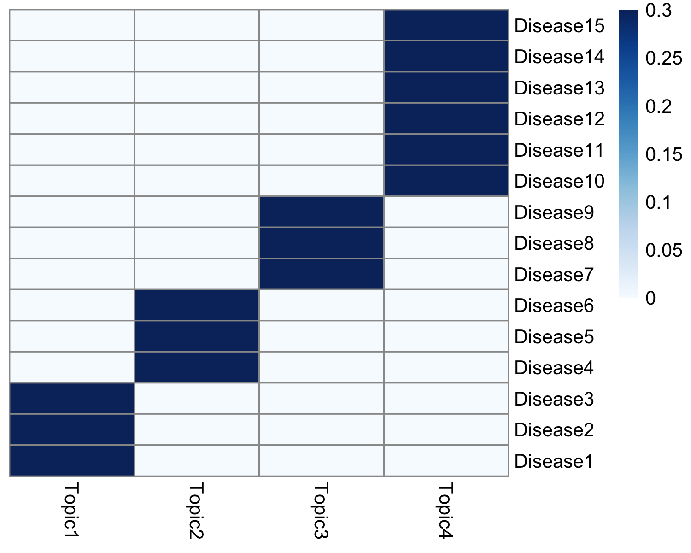
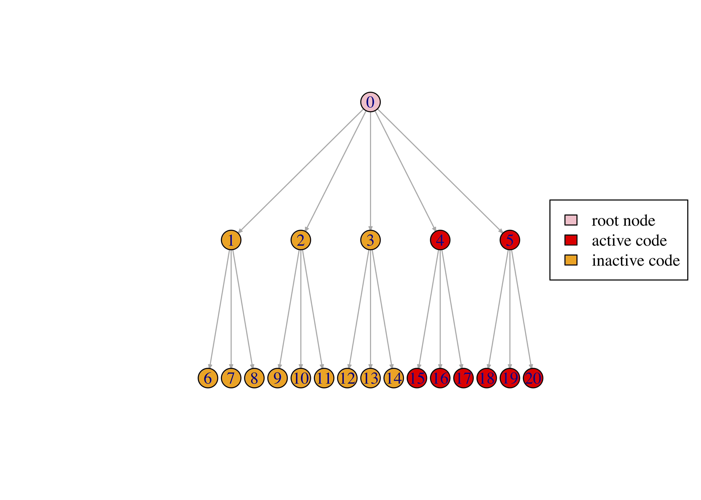

<style type="text/css">
  body{
  font-size: 12pt;
}
</style>


```{r setup, include=FALSE}
knitr::opts_chunk$set(echo=FALSE,warning=FALSE,message=TRUE)
```


treeLFA is a topic model based on Bayesian binary non-negative matrix factorization, and is used to infer topics of disease codes from binary diagnosis data. This tutorial gives an example of running treeLFA on a small simulated dataset. 
Firstly, load the libraries and source the relevant scripts: 
```{r,message=FALSE}
library(data.table)
library(Rcpp)
library(RcppParallel)
library(dqrng)
library(pheatmap)
library(RColorBrewer)
library(coda)
library(lsa)
suppressWarnings(library(scran))
library(ggplot2)
```

```{r}
Rcpp::sourceCpp("treeLFA.g.new.cpp")
```

```{r}
Rcpp::sourceCpp("treeLFA.ge.new.cpp")
```

```{r}
Rcpp::sourceCpp("pl_mc.cpp")
```

```{r}
source(file="treeLFA.functions.R")
```


There are two inputs for treeLFA: the diagnosis data, and the tree structure of disease codes. 
The diagnosis data is a bianry matrix in which the presence and absence of all disease codes for all individuals are recorded. Each row in the input matrix is an individual, and each column is a disease code. 
The example dataset contains the diagnostic record of 15 disease codes for 5,000 individuals. 
```{r echo=TRUE, message=FALSE, warning=FALSE, paged.print=TRUE}
data <- fread("simu.train.data.new.txt")    
print(head(data))
```

The input data for treeLFA is simulated using the generative process of treeLFA and four topics. The heatmap below shows the four topics, where each row is a disease code and each column is a topic. Each topic is a vector of probability for the 15 disease codes. 

```{r, out.width="40%"}

```

The schematic of the tree structure for the 15 disease codes is shown below. There are 5 internal nodes on the 2nd layer of the tree, and 15 terminal nodes on the bottom layer (each corresponds to a disease code). Each node on the 2nd layer has 3 children nodes on the bottom layer. The active codes in the 4th topic above are highlighted in red: 

```{r, out.width="50%"}

```

The tree structure of disease codes is stored in a table in which the parent code for each code on the tree is recorded. The first layer of the tree only contains the "root" code. For disease codes on the 2nd layer of the tree, there parent code mush be the root code (named as "root" in the matrix). If the tree matrix is not in correct format, corresponding error messages will pop out. 
```{r, echo=TRUE}
tree_str <- fread("tree.str.simu.txt")    
print(head(tree_str,10))
```


With the input data prepared, the Gibbs-EM algorithm for treeLFA can be used to optimize alpha (The hyperparameter of the Dirichlet prior for topic weights) while doing the inference of other hidden variables. The number of topics to be inferred (argument "topic.number" in the "gibbs_EM_train" function below) needs to be set. The initial alpha (argument "alpha") is set to be (0.1,0.1,0.1,0.1), which was the true alpha used to simulate the data. On real world dataset, it is recommended to set alpha as (1,0.1,...0.1).   
In addition, the "burn_in" argument denotes the number of Gibbs sampling iterations (19 was proved to be a good choice) in each E-step before the collection of samples of hidden variables, which are then used for optimization of alpha in the M-step. There are two stages of training. For both stages, the total number of EM cycles (arguements "cycle_1" and "cycle_2") and the number of hidden variables collected in the E-step can be set (arguement "opt_N_1" and "opt_N_2"). Note that in stage 1, "opt_N_1" is usually set to be 1 to speed up the traniing. In stage 2, "opt_N_2" can be set to a value larger than 1 to achieve more accurate optimization of alpha. The Gibbs-EM training here will take about two minutes. 
```{r, echo=TRUE,results='hide'}
ge_result <- gibbs_EM_train( topic.number=10,
                             data,tree_str,
                             burn_in=19, 
                             alpha=rep(0.1,10),
                             opt_N_1=1, cycle_1=500, 
                             opt_N_2=10, cycle_2=50 )
```
In the result object "ge_result", values of all hidden variables and the hyperparameter alpha in the last cycle of the Gibbs-EM training are stored. The hidden variables include probability variables of disease codes in topics (Phi), indicator variables of disease codes in topics (I), transition probability variables of the Markov process on the tree (rho), and topic assignment variables for all individuals' disease codes (Z). The full likelihood of the treeLFA model in all Gibbs-EM cycle are also recorded, and can be plotted to monitor the convergence. 
```{r pressure, echo=TRUE, out.width="40%"}
plot(1:length(ge_result$L_all),ge_result$L_all,type="line",xlab="Gibbs-EM cycles",ylab="Log10-Likelihood")
```

On very large datasets, the Gibbs-EM training can be divided into sevaral phases. By setting the hidden variables (Phi, I, rho, Z) and alpha in the "gibbs_EM_train" function, previous training can be continued by setting initial values of hidden variables as those from previous training.
```{r,echo=TRUE,results='hide'}
# ge_result <- gibbs_EM_train( topic.number=4,
#                              data,tree_str,
#                              Phi=ge_result$Phi_samples, 
#                              I=ge_result$I_samples, 
#                              rho=ge_result$rho_samples, 
#                              alpha=ge_result$alpha_samples, 
#                              Z=ge_result$Z_samples,
#                              burn_in=19, 
#                              opt_N_1=1, cycle_1=500, 
#                              opt_N_2=10, cycle_2=50 )
```

With alpha optimized and fixed, Gibbs sampling can be used to collected multiple posterior sampels of hidden variables. The number of burn in Gibbs iterations (argument "burn_in"), the total number of Gibbs iterations (argument "cycle") and the number of interval iterations while collecting posterior samples (argument "interval") need to be set: 
```{r, echo=TRUE,results='hide'}
g_result <- gibbs_train( data,tree_str=tree_str,
                         Phi=ge_result$Phi_samples, 
                         I=ge_result$I_samples, 
                         rho=ge_result$rho_samples, 
                         alpha=ge_result$alpha_samples, 
                         Z=ge_result$Z_samples,
                         burn_in=2500, cycle=5000, interval=100  )
```

Inferred topics can be plotted (in this example the 5th posteior sample of topics) to compare with the true topics shown above. The order of inferred and true topics can be different.
```{r, echo=TRUE, out.width="40%"}
topics_plot( g_result$Phi_samples[[5]] )      # Use the 5th posterior sample of topics
```


Predictive likelihood (on log10 scale) on the testing data can be calcualted as below. The 1st posterior sample given by the Gibbs sampler in the step above is used to calculate the predictive likelihood. The argument "IS" denotes the number of monte-carlo samples of topic weights (theta) used in approximating the predictive likelihood. Note that the testing data and training data should have the same column names.
```{r, echo=TRUE}
data_test <- fread("simu.test.data.txt")    
pl <- predL( g_result$alpha, g_result$Phi_samples[[1]], data, IS=200 )
print(pl)
```


To combine multiple posterior samples of hidden variables for downstream analyses, posterior samples of inferred topics can be clustered firstly, followed by the clustering of other hidden variables. Louvain algorithm can be applied using the "cls_louvain" function:  
```{r,echo=TRUE,message=FALSE}
g_result <- cls_louvain(g_result,k=25)
```
The "g_result" in the function is the result object given by the Gibbs sampling function for treeLFA in the previous step, and "k" is a parameter for the Louvain algorithm, which specifies the number of neighbours considered to build the shared nearest neighbour graph. Large values for k will result in fewer clusters (as similar small clusters will be combined into a larger one), while small values for k will result in many smaller clusters. It is recommended to use an integer within the range of (N_ps/2,N_ps) for k, where N_ps is the number of posterior samples of hidden variables given by the Gibbs sampler.
In the new "g_result" object, the "topics_ave" matrix stores the averaged topic vector for each cluster. 


In case that there are still repetitive topics after the louvain clustering (averaged topics can be plotted to check if there are still repetitive ones), hierarchical clustering can be applied on the averaged topics to further combine very similar ones: 
```{r,echo=TRUE}
g_result <- cls_hier(g_result,k=4)
```
The number of distinct topics to be kept can be manually set with the parameter "k" for the "cls_hier" function.    
In the new "g_result" object, the "topics_ave_h" matrix stores the topics kept after the hierarchical clustering. 


Topics given by the hierarchcial clustering can be plotted and checked: 
```{r,echo=TRUE,out.width="10%"}
topics_plot( g_result$topics_ave_h )  
```

In the last step, other hidden variables can be put into corresponding clusters based on the clustering result for topics: 
```{r,echo=TRUE}
g_result <- cls_others(g_result)
```
In the new "g_result" object, the "tw_ave" matrix stores the averaged topic weights for all individuals, and the "alpha_ave" is the averaged hyperparameter alpha. The averaged topic weights for individuals can be used for downstream association analysis (such as topic-GWAS). 


The first five individuals' topic weights are plotted for visualization: 
```{r,echo=TRUE,out.width="50%"}
tw_plot( g_result$tw_ave[1:5,] )  

```

