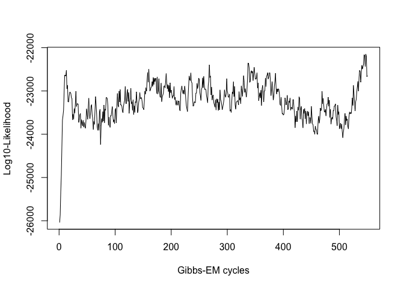
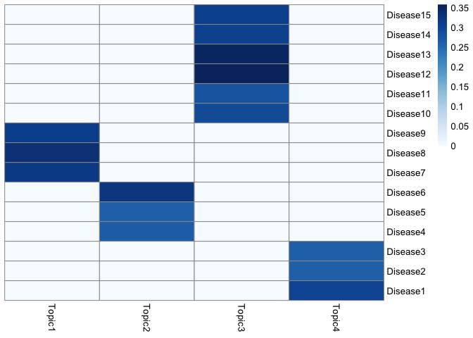
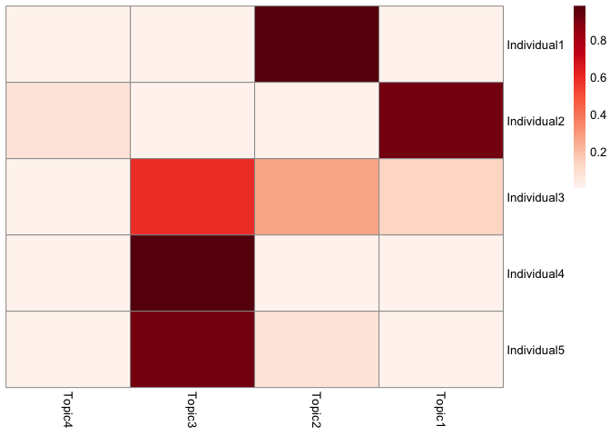

treeLFA-demo
================
Yidong Zhang

<style type="text/css">
  body{
  font-size: 12pt;
}
</style>

treeLFA is a topic model based on Bayesian binary non-negative matrix
factorization, and is used to infer topics of disease codes from binary
diagnosis data. This tutorial gives an example of running treeLFA on a
small simulated dataset. Firstly, load the libraries and source the
relevant scripts:

There are two inputs for treeLFA: the diagnosis data, and the tree
structure of disease codes. The diagnosis data is a bianry matrix in
which the presence and absence of all disease codes for all individuals
are recorded. Each row in the input matrix is an individual, and each
column is a disease code. The example dataset contains the diagnostic
record of 15 disease codes for 5,000 individuals.

``` r
data <- fread("simu.train.data.txt")    
print(head(data))
```

    ##    Disease1 Disease2 Disease3 Disease4 Disease5 Disease6 Disease7 Disease8
    ## 1:        0        0        0        0        0        0        0        0
    ## 2:        0        0        0        0        0        0        0        1
    ## 3:        0        0        0        0        0        1        0        0
    ## 4:        0        0        0        0        0        0        0        0
    ## 5:        0        0        0        0        0        0        0        0
    ## 6:        0        0        0        0        0        0        0        0
    ##    Disease9 Disease10 Disease11 Disease12 Disease13 Disease14 Disease15
    ## 1:        0         0         0         0         0         0         0
    ## 2:        0         0         0         0         0         0         0
    ## 3:        0         0         0         1         0         0         0
    ## 4:        0         0         1         1         0         0         0
    ## 5:        0         0         0         0         0         0         0
    ## 6:        0         0         0         0         0         0         0

The input data for treeLFA is simulated using the generative process of
treeLFA and four topics. The heatmap below shows the four topics, where
each row is a disease code and each column is a topic. Each topic is a
vector of probability for the 15 disease codes.


The schematic of the tree structure for the 15 disease codes is shown
below. There are 5 internal nodes on the 2nd layer of the tree, and 15
terminal nodes on the bottom layer (each corresponds to a disease code).
Each node on the 2nd layer has 3 children nodes on the bottom layer. The
active codes in the 4th topic above are highlighted in red:


The tree structure of disease codes is encoded in a matrix where the
parent code for each disease code on the tree is recorded. The terminal
disease codes (all disease codes in the input dataset) and the layer of
all codes on the tree are also specified in the matrix, such that some
basic checkings for the tree structure can be done to avoid formatting
issues. The four columns should be names as “node”, “parent”, “layer”
and “terminal” in order. If a disease code is on layer X, then its
parent code must be on layer X-1. For disease codes on the 2nd layer of
the tree, there parent code mush be the root code (named as “root” in
the matrix). If the tree matrix is not in correct format, corresponding
error messages will pop out.

``` r
tree_str <- fread("tree.str.simu.txt")    
print(head(tree_str,10))
```

    ##          node    parent layer terminal
    ##  1: Category1      root     2        N
    ##  2: Category2      root     2        N
    ##  3: Category3      root     2        N
    ##  4: Category4      root     2        N
    ##  5: Category5      root     2        N
    ##  6:  Disease1 Category1     3        Y
    ##  7:  Disease2 Category1     3        Y
    ##  8:  Disease3 Category1     3        Y
    ##  9:  Disease4 Category2     3        Y
    ## 10:  Disease5 Category2     3        Y

With the input data prepared, the Gibbs-EM algorithm for treeLFA can be
used to optimize alpha (The hyperparameter of the Dirichlet prior for
topic weights) while doing the inference of other hidden variables. The
number of topics to be inferred (argument “topic.number” in the
“gibbs\_EM\_train” function below) needs to be set. The initial alpha
(argument “alpha”) is set to be (0.1,0.1,0.1,0.1), which was the true
alpha used to simulate the data. On real world dataset, it is
recommended to set alpha as (1,0.1,…0.1).  
In addition, the “burn\_in” argument denotes the number of Gibbs
sampling iterations (19 was proved to be a good choice) in each E-step
before the collection of samples of hidden variables, which are then
used for optimization of alpha in the M-step. There are two stages of
training. For both stages, the total number of EM cycles (arguements
“cycle\_1” and “cycle\_2”) and the number of hidden variables
collected in the E-step can be set (arguement “opt\_N\_1” and
“opt\_N\_2”). Note that in stage 1, “opt\_N\_1” is usually set to be
1 to speed up the traniing. In stage 2, “opt\_N\_2” can be set to a
value larger than 1 to achieve more accurate optimization of alpha. The
Gibbs-EM training here will take about two minutes.

``` r
ge_result <- gibbs_EM_train( topic.number=4,
                             data,tree_str,
                             burn_in=19, 
                             alpha=c(0.1,0.1,0.1,0.1),
                             opt_N_1=1, cycle_1=500, 
                             opt_N_2=10, cycle_2=50 )
```

In the result object “ge\_result”, values of all hidden variables and
the hyperparameter alpha in the last cycle of the Gibbs-EM training are
stored. The hidden variables include probability variables of disease
codes in topics (Phi), indicator variables of disease codes in topics
(I), transition probability variables of the Markov process on the tree
(rho), and topic assignment variables for all individuals’ disease codes
(Z). The full likelihood of the treeLFA model in all Gibbs-EM cycle are
also recorded, and can be plotted to monitor the
convergence.

``` r
plot(1:length(ge_result$L_all),ge_result$L_all,type="line",xlab="Gibbs-EM cycles",ylab="Log10-Likelihood")
```



On very large datasets, the Gibbs-EM training can be divided into
sevaral phases. By setting the hidden variables (Phi, I, rho, Z) and
alpha in the “gibbs\_EM\_train” function, previous training can be
continued by setting initial values of hidden variables as those from
previous training.

``` r
# ge_result <- gibbs_EM_train( topic.number=4,
#                              data,tree_str,
#                              Phi=ge_result$Phi_samples, 
#                              I=ge_result$I_samples, 
#                              rho=ge_result$rho_samples, 
#                              alpha=ge_result$alpha_samples, 
#                              Z=ge_result$Z_samples,
#                              burn_in=19, 
#                              opt_N_1=1, cycle_1=1, 
#                              opt_N_2=1, cycle_2=1 )
```

With alpha optimized and fixed, Gibbs sampling can be used to collected
multiple posterior sampels of hidden variables. The number of burn in
Gibbs iterations (argument “burn\_in”), the total number of Gibbs
iterations (argument “cycle”) and the number of interval iterations
while collecting posterior samples (argument “interval”) need to be set:

``` r
g_result <- gibbs_train( data,tree_str,
                         Phi=ge_result$Phi_samples, 
                         I=ge_result$I_samples, 
                         rho=ge_result$rho_samples, 
                         alpha=ge_result$alpha_samples, 
                         Z=ge_result$Z_samples,
                         burn_in=2500, cycle=5000, interval=100  )
```

Inferred topics can be plotted (in this example the 5th posteior sample
of topics) to compare with the true topics shown above. The order of
inferred and true topics can be
different.

``` r
topics_plot( g_result$Phi_samples[[5]] )      # Use the 5th posterior sample of topics
```



Predictive likelihood (on log10 scale) on the testing data can be
calcualted as below. The 1st posterior sample given by the Gibbs sampler
in the step above is used to calculate the predictive likelihood. The
argument “IS” denotes the number of monte-carlo samples of topic weights
(theta) used in approximating the predictive likelihood. Note that the
testing data and training data should have the same column names.

``` r
data_test <- fread("simu.test.data.txt")    
pl <- predL( g_result$alpha, g_result$Phi_samples[[1]], data, IS=100 )
print(pl)
```

    ## [1] -7911.611

To combine multiple posterior samples of hidden variables for downstream
analyses, posterior samples of inferred topics can be clustered firstly,
followed by the clustering of other hidden variables. Louvain algorithm
can be applied using the “cls\_louvain” function:

``` r
g_result <- cls_louvain(g_result,k=25)
```

The “g\_result” in the function is the result object given by the Gibbs
sampling function for treeLFA in the previous step, and “k” is a
parameter for the Louvain algorithm, which specifies the number of
neighbours considered to build the shared nearest neighbour graph. Large
values for k will result in fewer clusters (as similar small clusters
will be combined into a larger one), while small values for k will
result in many smaller clusters. It is recommended to use an integer
within the range of (N\_ps/2,N\_ps) for k, where N\_ps is the number of
posterior samples of hidden variables given by the Gibbs sampler. In the
new “g\_result” object, the “topics\_ave” matrix stores the averaged
topic vector for each cluster.

In case that there are still repetitive topics after the louvain
clustering (averaged topics can be plotted to check if there are still
repetitive ones), hierarchical clustering can be applied on the averaged
topics to further combine very similar ones:

``` r
g_result <- cls_hier(g_result,k=4)
```

The number of distinct topics to be kept can be manually set with the
parameter “k” for the “cls\_hier” function.  
In the new “g\_result” object, the “topics\_ave\_h” matrix stores the
topics kept after the hierarchical clustering.

Topics given by the hierarchcial clustering can be plotted and checked:

``` r
topics_plot( g_result$topics_ave_h )  
```

<!-- -->

In the last step, other hidden variables can be put into corresponding
clusters based on the clustering result for topics:

``` r
g_result <- cls_others(g_result)
```

In the new “g\_result” object, the “tw\_ave” matrix stores the averaged
topic weights for all individuals, and the “alpha\_ave” is the averaged
hyperparameter alpha. The averaged topic weights for individuals can be
used for downstream association analysis (such as topic-GWAS).

``` r
tw_plot( g_result$tw_ave[1:5,] )  
```


